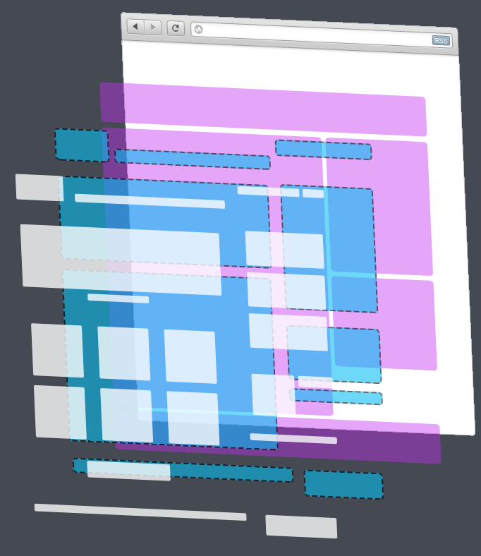

LMC Методология
===============
> *layout module component*
> Принципом методологии является максимальная модульность, независимость
> и переиспользование блоков верстки.

Структура:
---------

  - Базовый слой (base)
  - Слой разметки (layout)
  - Слой модулей (module)
  - Слой компонентов (component)
  - Слой модификаций

Base
----
  Основные правила для этого слоя:
  - сбросы стилей ( normalize, reset, etc. );
  - конфигураци, миксины, функции, переменные sass и compass
  - стили для общих элементов без классов и id ( html, body, a, ul, etc. );

Layout
------
  Основные правила для этого слоя:
  - стили для общей разметки и сетки страницы ( .l-header, .l-col_12, .l-aside,
      etc. ).
  - классы начинаются с префикса ".l-";

Module
------

  Основные правила для этого слоя:
  - стили для абсолютно независимых блоков, которые могу в себе содержать другие модули, подмодули, либо компоненты;
  - классы начинаются с префикса ".m-";
  - имя модуля состоящего из более чем 1-го слова разделяются
      символом тире "-" ( .m-reg-form, .m-shopping-cart, etc. );
  - имя подмодуля составляется из имени модуля + символ нижнего подчеркивания "_" + имя подмодуля (.m-form_item)

Component
---------
  Основные правила для этого слоя:
  - наименьшие целостные элементы страницы (.c-input, .c-button, .c-dropdown-menu, .c-select);
  - классы начинаются с префикса ".с-";

Modification
------------
  Основные правила для этого слоя:
  - добавляет дополнительные свойства для layout, module или component
  - классы начинаются с префикса ".__";

Ссылки на частоиспользуемые плагины:
------------------------------------
 - Стилизация форм [<https://github.com/Dimox/jQueryFormStyler>]
 - Кастомизация скролла [<https://github.com/inuyaksa/jquery.nicescroll>]
 - Скролл эффекты [<https://github.com/chayka/jQuery.Scroolly>]
 - Датапикер [<https://github.com/dbushell/Pikaday>]
 - Слайдер [<https://github.com/nolimits4web/Swiper>]
 - Рейтинг [<https://github.com/wbotelhos/raty>]
